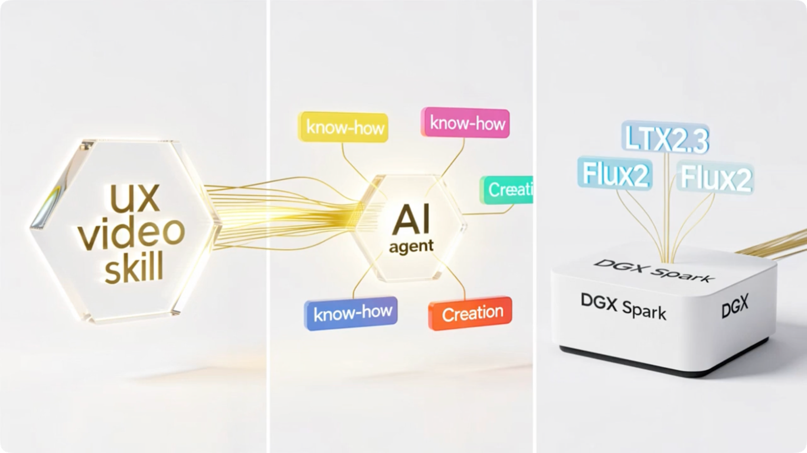

[English](README.md) | 中文

# UltraX Video —— 端到端 AI 视频创作 Skill

> **让视频创作回归内容和创意，将工具和复杂性交给 Agent。**

`uxvideo` 是一个可被任意 AI Agent 装载的端到端视频创作 skill：驱动一套完全私有化的生成栈，
把一个项目从创意一路做到成片 —— 覆盖内容策划、分镜头创建、视频生成、配音、配乐的全过程。

> 🏆 本项目源自我们入围 **NVIDIA DGX Spark 黑客松大赛决赛** 的项目。

▶ 点击下图观看产品介绍视频：

## 亮点

- **端到端流程** —— 内容策划 → 分镜头创建 → 视频生成 → 配音 → 配乐，一站式打通。
- **覆盖多种视频类型** —— 数字人（口播）、故事讲述、MV、Vlog、访谈等。
- **完全私有化方案** —— 适用于 16G 以下显存显卡，包括 12G 显卡。
- **灵活输出** —— 支持 9:16、16:9、3:4 等多种分辨率，480p 视频创建。
- **支持 2K 图片创建。**
- **情绪感知的多人配音方案。**

## Demo

用 `uxvideo` skill 生成的短视频示例（点击封面跳转 B 站播放）：

<table><tr>
<td align="center" width="33%"><a href="https://www.bilibili.com/video/BV1NHgk6sEuk"> ▶ 少林女足</a></td>
<td align="center" width="33%"><a href="https://www.bilibili.com/video/BV1wxgk6QEaq"> ▶ Kimi K3</a></td>
<td align="center" width="33%"><a href="https://www.bilibili.com/video/BV1dygy67Enr"> ▶ 徒步Vlog</a></td>
</tr></table>

## 快速上手

`uxvideo` 由装载并编排它的 Agent 平台 **UltraXBot** 运行。

**[下载 UltraXBot · 了解更多 →](https://agent.ultraxbot.com/#/)**
